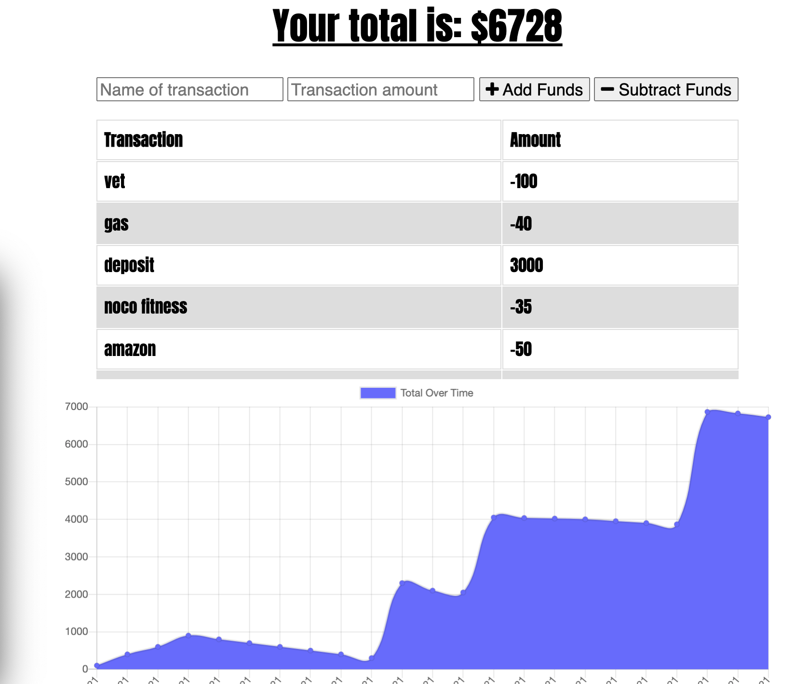

# Online/Offline Budget-Tracker
Built using Progressive Web Apps. PWAs are web apps that use service workers, manifests, and other web-platform features in combination with progressive enhancement to give users an experience on par with native apps.

#### Service Worker
- #### Purpose
    - Service worker provides a programmatic way to cache app resources.  

- #### Service Worker Life Cycle
    - install
    - activate
    - fetch

## User Story
````
AS AN avid traveller 
I WANT to be able to track my withdrawals and deposits with or without a data/internet connection
SO THAT my account balance is accurate when I am traveling
````

# Business Context

Giving users a fast and easy way to track their money is important, but allowing them to access that information anytime is even more important. Having offline functionality is paramount to our applications success.

This application allows users to keep track of their expenses and deposits on or offline.

# Screenshot


# Live URL
[Click here to track your budget](https://tr-budgettracker.herokuapp.com/)
